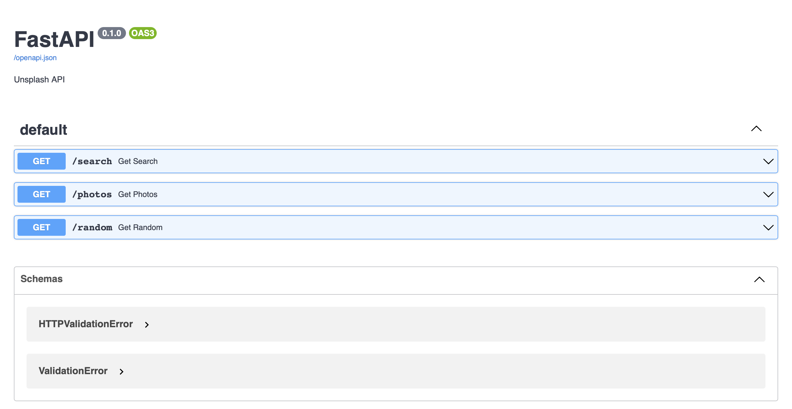

<h1>Unsplash API</h1>

<h2>Contents</h2>

Before using the Unsplash API, <a href="https://unsplash.com/developers">register</a> 
as a developer and get your access key. After that, use that key as your <i>client_id</i>

<h2>Installation</h2>
<pre>$ pip install requirements.txt</pre>

<h2>Run</h2>
<pre>$ sudo docker compose up -d</pre>
<pre>0.0.0.0:8000/docs  # Open on browser</pre>

<h2>How to use it?</h2>

<h3>Search</h3>
Unsplash search bar endpoint
<ul>
    <li><b>query</b> : Search parameter (<i>Default: nature</i>)</li>
    <li><b>page</b> : Page number (<i>Default: 1</i>)</li>
    <li><b>per_page</b> : Photos count per page (<i>Default: 20</i>)</li>
    <li><b>order_by</b> : Order photos (<i>Default: relevant</i>)</li>
</ul>

<h3>Photos</h3>
Landing page endpoint
<ul>
    <li><b>page</b> : Page number (<i>Default: 1</i>)</li>
    <li><b>per_page</b> : Photos count per page (<i>Default: 20</i>)</li>
    <li><b>order_by</b> : Order photos (<i>Default: relevant</i>)</li>
</ul>

<h3>Random</h3>
Random photo pick endpoint
<ul>
    <li><b>query</b> : Search parameter (<i>Default: nature</i>)</li>
    <li><b>count</b> : Pick count (<i>Default: 1</i>)</li>
</ul>

For more, visit the <a href="https://unsplash.com/documentation">documentation</a>
